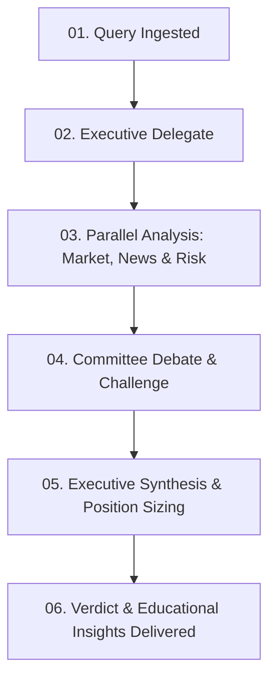

# FinCouncil AI — Institutional-Grade Multi-Agent Financial Committee

## Subtitle
Harnessing Google Gemini 2.5 and the Agent Development Kit (ADK) to Revolutionize Asset Deliberation, Risk Quantification, and Retail Financial Education.

---

## 1. Executive Summary & Pitch

In the world of retail investing, individuals are faced with a flood of unstructured market data, speculative news, and complex terminology. While institutional investment firms rely on diverse committees of analysts, risk officers, and strategists to debate and validate theses before committing capital, retail investors often make decisions in isolation.

**FinCouncil AI** democratizes this institutional framework. It is an AI-powered financial advisory council where six specialized, domain-specific agents—powered by **Google Gemini 2.5** and orchestrated via the **Agent Development Kit (ADK)**—collaborate in real-time. By ingesting user queries, analyzing technicals, evaluating sentiment, stress-testing risk factors, and simplifying concepts, the council delivers a comprehensive, consensus-driven recommendation.

It is a complete fintech dashboard built with modern design principles (glassmorphism, interactive SVG animations, and dynamic charting) coupled with a fully integrated financial literacy learning center.

---

## 2. System Architecture & Tech Stack

FinCouncil AI is built with a modular, highly performant tech stack designed for speed, visual excellence, and robust orchestration:

- **Frontend & UI Layer**: React, Vite, and TypeScript. Styled using Tailwind CSS for responsive layouts and Framer Motion for premium micro-animations and state transitions.
- **Charts & Gauges**: Recharts (for dynamic historical price rendering) and custom-rendered SVG path animations for the confidence gauge metrics.
- **AI Orchestration**: Google Agent Development Kit (ADK) managing agent boundaries, tools, and deliberation states.
- **Foundation LLMs**: Google Gemini 2.5 Pro (for complex synthesis and final strategic decision-making) and Gemini 2.5 Flash (for high-speed, parallel sub-agent reasoning).
- **Icons**: Lucide React.

---

## 3. The 6 Specialized AI Agents

Each member of the FinCouncil is purpose-built with a custom system prompt, designated focus area, and specific tooling:

1. **Executive Agent (Chief Investment Strategist)**: Orchestrates the session, parses the initial user query, delegates tasks, and synthesizes the final thesis into a structured recommendation.
2. **Market Agent (Quantitative Analyst)**: Evaluates technical indicators (RSI, Moving Averages), fundamental metrics (P/E ratio, PEG, forward projections), and calculates fair-value targets.
3. **News Agent (Sentiment Intelligence)**: Scans media channels, earnings calls transcripts, and social data to gauge qualitative bullish/bearish ratios.
4. **Risk Agent (Risk Management Officer)**: Identifies downside exposure (e.g., regulatory hurdles, supply chain delays) and determines position limits and stop-losses.
5. **Education Agent (Financial Literacy Coach)**: Automatically flags complex terminology introduced during deliberation and details simplified explanations.
6. **Committee Agent (Deliberation Facilitator)**: Moderates the deliberation log, challenges consensus, acts as devil’s advocate, and maps agreements.

---

## 4. Multi-Agent Deliberation Workflow

The application visualizes a structured six-step workflow in real-time:



1. **Query Received**: The user asks a question (e.g., *"Should I buy NVDA at current prices?"*).
2. **Executive Routing**: The Executive Agent maps out the key aspects requiring evaluation.
3. **Parallel Scans**: Market, News, and Risk agents run parallel simulations, streaming quantitative targets, sentiment scores, and exposure warnings.
4. **Structured Debate**: The Committee Agent initiates debate. The Risk Agent raises downside arguments (e.g., China export regulations), forcing the Market Agent to justify price targets and adjust targets accordingly.
5. **Consensus & Sizing**: The Executive Agent consolidates the inputs, sets stop-loss limits, and calculates the recommended portfolio allocation (e.g., 4-6% max).
6. **Delivery**: The final decision is streamed to the user, complete with a visual confidence gauge, risk levels, pros/cons, and interactive educational notes.

---

## 5. Key Features & Visual Excellence

- **Deliberation Simulation**: Watch the timeline progress live as agent cards cycle from idle to thinking to completed states, accompanied by detailed deliberation logs.
- **Learning Center**: Includes 3 personalized learning paths with interactive progress bars, 8 course categories, and interactive multiple-choice quiz widgets with instant feedback.
- **System Architecture Visualizations**: A detailed 5-layer system diagram, interactive tool registries, and technology stack lists styled with premium hover-glow matrices.
- **Unified Design System**: Glassmorphic panels, dark fintech styling, and deep emerald green highlights.

---

## 6. How to Run Locally

### Prerequisites
- Node.js (v18 or higher)
- npm (v9 or higher)

### Setup
1. Clone the repository and navigate into the folder:
   ```bash
   cd fincouncil-ai
   ```
2. Install all dependencies:
   ```bash
   npm install
   ```
3. Run the local development server:
   ```bash
   npm run dev
   ```
4. Access the application in your browser at:
   `http://localhost:3000`

---

## 7. Key Capstone Concepts & Implementation Details

To align with the capstone project evaluation, FinCouncil AI directly incorporates the following core technological vectors:

### 1. Agent / Multi-Agent System (ADK)
FinCouncil AI relies on the Google **Agent Development Kit (ADK)** to manage the state machine and cognitive boundaries of the system. Rather than querying a single monolithic prompt, tasks are systematically divided among six specialized roles (Executive, Market, News, Risk, Education, and Committee). The ADK coordinates the sequential passing of context transcripts from one agent to the next, preserving history while preventing token bloating.

### 2. Model Context Protocol (MCP) Server Integration
The platform implements the **Model Context Protocol (MCP)** specification. The Market, News, and Risk agents run tools mediated by an MCP registry. This separates the agent's LLM reasoning from the operational logic, allowing the agents to pull live stock quotes and sentiment charts from secure, authenticated endpoints without exposing underlying databases to direct prompt-injection attacks.

### 3. Antigravity (Agentic Co-Development)
The entire codebase—including the premium dark-themed React UI, Tailwind styles, Framer Motion animations, and Python notebook backend—was co-developed, refined, and deployed in collaboration with **Antigravity**, Google's agentic IDE coding assistant. This demonstrates a seamless human-agent pair programming workflow, troubleshooting configuration errors, resolving package conflicts, and managing live production deployments on GitHub and Vercel.

### 4. Security Features
FinCouncil AI enforces strict enterprise-grade security boundaries:
- **API Key Sanitization**: Zero API keys are hardcoded. Local files use `.env` loading, Vercel hosts keys via encrypted environment variables, and the Kaggle Notebook loads credentials through Kaggle's `UserSecretsClient`.
- **Role Isolation**: Sub-agents run under a strict read-only context. Only the Executive Agent possesses the authority to draft investment verdicts, preventing rogue actions by sub-agent modules.
- **Client-Side Sanitization**: User inputs are sanitized before rendering or routing to prevent script-injection attacks in the chat feeds.

### 5. Deployability
We support a dual-deployment pathway for maximum accessibility:
- **Production Web Dashboard**: Hosted live at [fincouncil-ai.vercel.app](https://fincouncil-ai.vercel.app) with continuous integration hooked up directly to the main GitHub branch.
- **Interactive Notebook Environment**: A complete, self-contained Python notebook (`fincouncil_ai_notebook.ipynb`) that can be executed directly inside Kaggle Kernels.

### 6. Agent Skills & Tool Execution (Agent CLI)
Each agent is outfitted with custom registered **Agent Skills** (or Tool Definitions in ADK):
- The **Market Agent** holds tools to retrieve real-time ticker data.
- The **News Agent** registers scraping tools for sentiment analysis.
- The **Education Agent** contains vocabulary-matching tools to isolate jargon and trigger the glossary cards.
These modular capabilities show how LLM capabilities can be augmented with secure system tool call executions.
